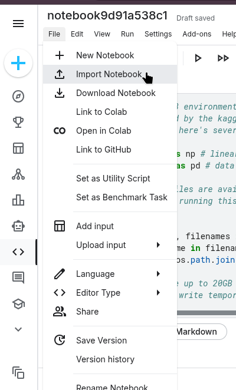
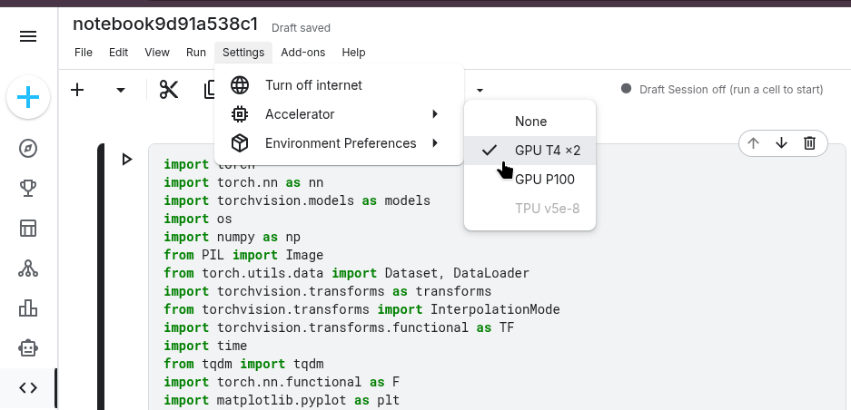
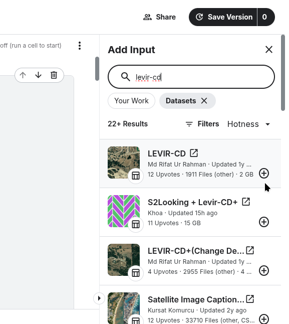
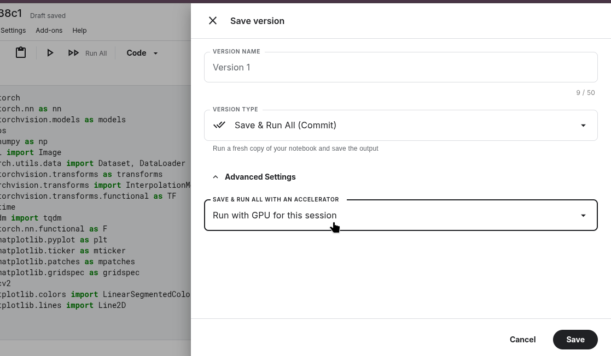

# DCBNet

## Setup & Run Guide

Documentation for reproducing training and evaluation of **DCBNet**

---

# Table of Contents

* [Getting the Code](#getting-the-code)
* [Getting the Datasets](#getting-the-datasets)
* [Running on Kaggle](#running-on-kaggle)
* [Running on a Local Machine](#running-on-a-local-machine)
* [Quick Reference Card](#quick-reference-card)

---

# Getting the Code

The notebook file (`.ipynb`) can be obtained from one of the two sources below.

## GitHub

Repository:

https://github.com/BotRavat/urban-change-detection-DCBNet

* Click **Code**
* Select **Download ZIP**
* Extract the archive
* The notebook file ends in `.ipynb`

## Google Drive

https://drive.google.com/drive/folders/13uSoW1oH2rAozqCPPbxGlxnk6F8BMeqJ?usp=sharing

* Open the folder
* Right-click the file
* Select **Download**

> Save the downloaded `.ipynb` file somewhere easy to locate (Desktop / Downloads).

---

# Getting the Datasets

Two datasets are used.

## LEVIR-CD (Public — available on Kaggle)

1. Go to Kaggle
2. Search for **LEVIR-CD**
3. Download it, or add directly as notebook input inside Kaggle

[Kaggle](https://www.kaggle.com)

---

## LIM-CD (Private Access / Official GitHub)

Two options:

### Option 1 — Request Access

Send your Kaggle username and access can be granted to the private Kaggle dataset.

### Option 2 — Official Repository

Download from there and upload manually as Kaggle dataset or place locally.

[LIM-CD Official Repository](https://github.com/xiaoxiangAQ/LIM-CD-dataset)

## Contact for LIM-CD access

`7sravat@gmail.com`

---

# Running on Kaggle

Kaggle provides free GPU access.

---

## Step 1 — Create a Kaggle Account

Create a free account at:

https://www.kaggle.com

---

## Step 2 — Create Notebook and Import Code

1. Open **Code**
2. Click **New Notebook**
3. File → Import Notebook
4. Browse and select `.ipynb`
5. Import



---

## Step 3 — Select GPU Accelerator

Choose either:

* GPU T4 x1
* GPU P100

> Kaggle provides 30 hours GPU time per week.



---

## Step 4 — Add Dataset Inputs

1. In right panel click **Add Input**
2. Search dataset name
3. Add dataset

Example path:

```bash
/kaggle/input/levir-cd/
```

For LIM-CD, add after access is granted.



---

## Step 5 — Configuration Cell Setup

Edit only the configuration cell.

---

## Mode Selection

Available modes:

| Mode       | Description                |
| ---------- | -------------------------- |
| `s1only`   | Train Stage 1 only         |
| `s2only`   | Train Stage 2 only         |
| `both`     | Train Stage 1 then Stage 2 |
| `eval_s1`  | Evaluate Stage 1 only      |
| `eval_s2`  | Evaluate Stage 2 only      |
| `eval_all` | Evaluate both stages       |

Example:

```python
MODE = "both"
```

---

## Weight Paths (Evaluation Only)

```python
S1_WEIGHTS = "/kaggle/input/your-weights-dataset/stage1_best.pth"
S2_WEIGHTS = "/kaggle/input/your-weights-dataset/stage2_best.pth"
```

Training mode can keep empty:

```python
""
```

---

## Epoch and Unfreeze Settings

```python
# Stage 1
S1_NUM_EPOCHS = 100
S1_UNFREEZE_EPOCH = 5

# Stage 2
S2_NUM_EPOCHS = 50
S2_UNFREEZE_EPOCH = 5
```

---

## Recommended Defaults

### LEVIR-CD

```python
S1_NUM_EPOCHS = 90–95
S1_UNFREEZE_EPOCH = 15–20

S2_NUM_EPOCHS = 40–45
S2_UNFREEZE_EPOCH = 15–20
```

### LIM-CD

```python
S1_NUM_EPOCHS = 45–50
S1_UNFREEZE_EPOCH = 15–20

S2_NUM_EPOCHS = 40–45
S2_UNFREEZE_EPOCH = 15–20
```

---

## Dataset Selection

```python
DATASET = "LEVIR-CD"
```

Supported values:

* `"LEVIR-CD"`
* `"LIM-CD"`

---

## Dataset Root

```python
DATASET_ROOT = {
    "LEVIR-CD": "/kaggle/input/levir-cd/",
    "LIM-CD": "/kaggle/input/lim-cd-dataset/",
}
```

---

## Step 6 — Running the Notebook

### Option A — Interactive Session

Run all cells manually.

> Keep browser open.

---

### Option B — Background Session

Use **Save Version → Save & Run All (Commit)**

Outputs saved under:

```bash
/kaggle/working/
```



---

# Running on a Local Machine

---

## Step 1 — Install Dependencies

Run dependency installation cell at notebook top first.

---

## Step 2 — Organise Dataset

```bash
project_folder/
    notebook.ipynb
    datasets/
        LEVIR-CD/
            train/
                A/
                B/
                label/
            val/
            test/
        LIM-CD/
            train/
            val/
            test/
```

---

## Step 3 — Set Local Paths

```python
DATASET_ROOT = {
    "LEVIR-CD": "/path/to/your/datasets/LEVIR-CD",
    "LIM-CD": "/path/to/your/datasets/LIM-CD",
}

S1_WEIGHTS = "/path/to/your/weights/stage1_best.pth"
S2_WEIGHTS = "/path/to/your/weights/stage2_best.pth"
```

Windows example:

```python
r"C:\Users\yourname\datasets\LEVIR-CD"
```

---

## Step 4 — Run Notebook

```bash
jupyter notebook notebook.ipynb
```

Then:

Kernel → Restart & Run All

---

# Quick Reference Card

| # | Step              | Check                    |
| - | ----------------- | ------------------------ |
| 1 | Notebook imported | `.ipynb` loaded          |
| 2 | GPU selected      | T4 or P100               |
| 3 | Dataset added     | LEVIR-CD or LIM-CD       |
| 4 | MODE set          | valid mode               |
| 5 | DATASET set       | correct dataset          |
| 6 | Weights provided  | eval only                |
| 7 | Epoch configured  | default or custom        |
| 8 | Session chosen    | interactive / background |

---

# Contact

If anything is unclear:

`7sravat@gmail.com`
